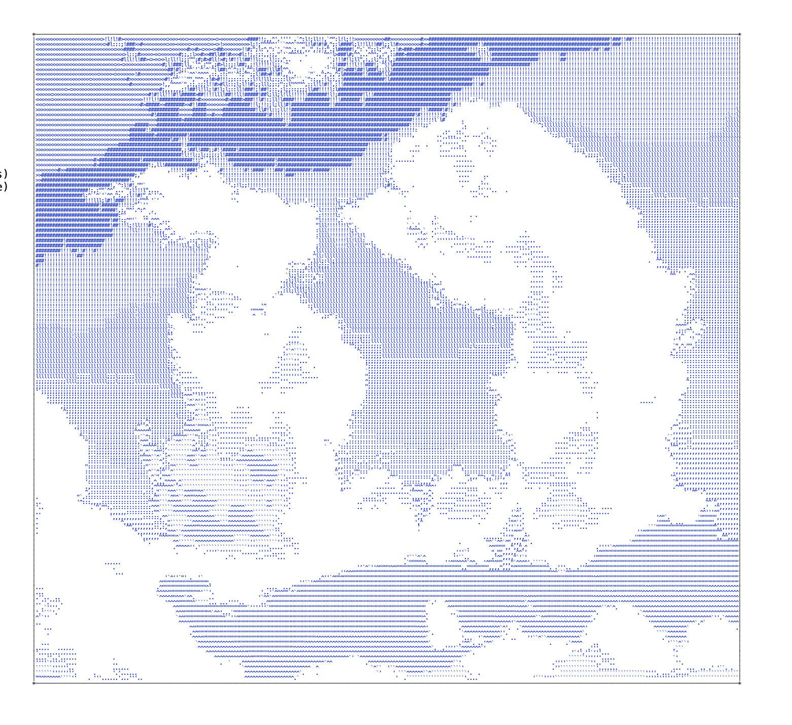

# Ascii Sketchbook

This is a sketchbook designed for imagemaking with monospace text. I use it for drawing and sometimes for writing.

You can draw using your mouse and different brushes, or rasterize images from your computer. This page stores your drawing as raw HTML text which can be copy-pasted.

This page is part of an [ongoing project]() exploring manipulations of digital data based on physical and organic processes.
  
  
Understanding technology as a physical, human, inherently political resource--as opposed to the neutral, fingerprint-less identity most tech companies portray it as--limits our ability to conceptualize the labor, violence, and natural resources that go into producing, maintaining, and integrating ourselves with technology.
  
