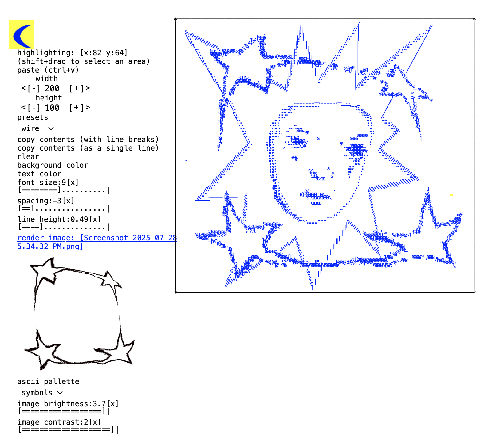

# Ascii Sketchbook

This is a sketchbook designed for experimenting with monospace text. I use it for drawing and for writing. The sketchbook is raw HTML text which can be copied or pasted into from other sources.

## **The Basics**

Typing text enters it into the canvas at the cursor location. The cursor can be moved by clicking, the arrow keys, or by typing if 'advance cursor when typing' is ticked.

Shift clicking+dragging will create a selection box, which can be cut, copied, moved with the arrow keys, or dragged with the mouse. By default, whitespaces will be treated as "transparent" when moving or pasting text, but can be preserved by unticking "blend transparent areas."

### Drawing

The character drawn is the last character pressed, show in the top left display box.

***brush***~ draw freehand lines by dragging the mouse. Brush thickness can be changed with the slider. Tick 'dynamic brush' to draw lines that resize thickness based on mouse speed.

***lines***~ draw straight lines by dragging the mouse.

***images*** ~ render an image to the canvas with the 'render image' button, or by pasting an image from the clipboard. You can control image contrast, brightness, and the character pallette used to render the image. ***Uploading or changing image settings will always overwrite the current canvas!***

### shortcuts
+ **Cmd+A** - select all
+ **Cmd+A** - undo
+ **Cmd+X** - cut selected area
+ **Cmd+C** - copy selected area
+ **Cmd+V** - paste clipboard
+ **Cmd+Backspace or '/'** - clear Canvas
+ **Backspace** - delete character
+ **Arrow keys** - move cursor or translate selected text
+ **Arrow keys** + Shift - translate row/column
+ **Enter** - move cursor down a line
+ **Enter+Shift** - insert blank line
